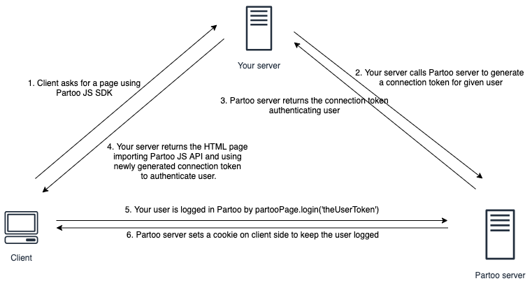
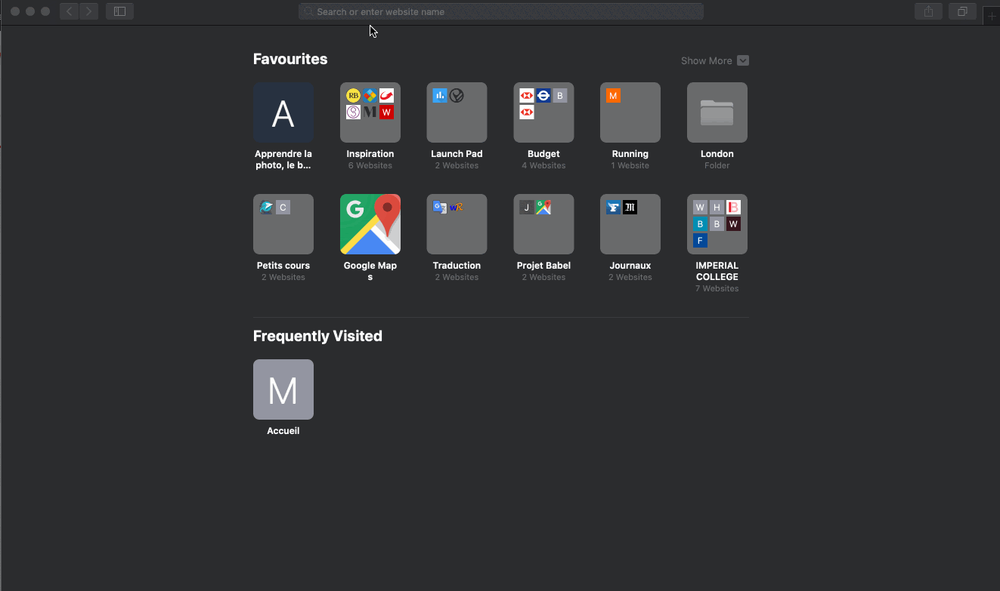

.. _authentication:

Authenticating your user
==========================================

.. warning::
    There are known issues with Safari.
    If your are developing an integration for Safari, please make sure to check `Safari integration limits`_ below.

.. warning::
    It is possible to login user using API key instead of connection token. **This is a deprecated behaviour that will be dropped on September the 1st, 2020**.

Most of Partoo App pages requires the user to be authenticated.

To authenticate your user, you must generate a connection token using Partoo REST API.
You can find the documentation of the endpoint `here <https://developers.partoo.co/rest_api/v2/#operation/generateConnectionToken>`_.

Once your connection token is generated, you can authenticate your user using the ``login`` method of the ``partooPage`` object.

.. code-block:: javascript

    partooPage.login('the-connection-token');  // this will log user and redirect him/her to the startPage (by default the business list)

This will make a call to partoo login view with the connection token in the query params.
Our application will recognize the connection token and set a session cookie on the user browser.
Thanks to this session cookie, the user will stay authenticated on the following calls.

Once the session cookie is expired you must re-authenticate the user.
As a connection token is short-lived & consumable, ie. it can be used only once,
you need to implement a integration to easily regenerate a connection token when your user access a protected view.
You can find below the schema of a possible integration:

.. _safari_integration_limits:

Safari integration limits
-------------------------------------------

By default, Safari prevent Iframes from setting cookie (to prevent commercial tracking based on cookie).
As the user authentication is based on cookie,
it means that by default it is not possible to log user with the JS SDK if the user is using Safari.

The user must change this default behaviour in Safari settings for the integration to work.
The setting is located in `Settings > Privacy > Website tracking` (see below).

