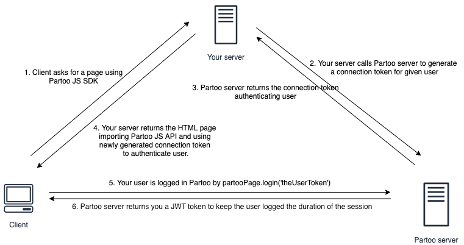

.. _authentication:

Authenticating your user
==========================================

.. warning::
    It is possible to login user using API key instead of connection token. **This is a deprecated behaviour that will be dropped on June the 15th, 2021**.

Most of Partoo App pages requires the user to be authenticated.

To authenticate your user, you must generate a connection token using Partoo REST API.
You can find the documentation of the endpoint `here <https://developers.partoo.co/rest_api/v2/#operation/generateConnectionToken>`_.

Once your connection token is generated, you can authenticate your user using the ``login`` method of the ``partooPage`` object.

.. code-block:: javascript

    partooPage.login('the-connection-token');  // this will log user and redirect him/her to the startPage (by default the business list)

This will make a call to partoo login view with the connection token in the query params.
Our application will recognize the connection token and return a JWT token.
Thanks to this JWT token, the user will stay authenticated on the following calls.

Once the JWT token is expired you must re-authenticate the user.
As a connection token is short-lived & consumable, ie. it can be used only once,
you need to implement a integration to easily regenerate a connection token when your user access a protected view.
You can find below the schema of a possible integration:

