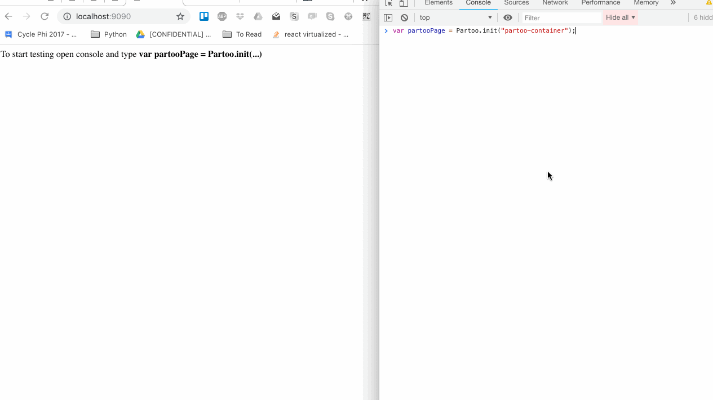
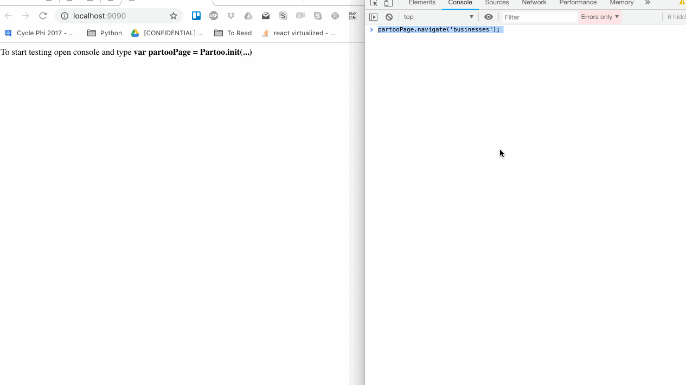
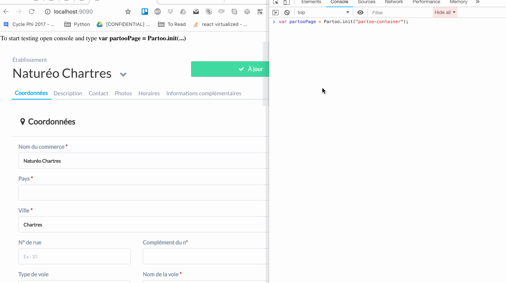
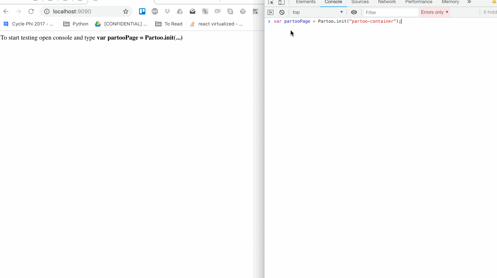

.. _pages_integration:

Integrating partoo pages
=================================

.. _pages_integration_navigation:

Navigation
---------------------------------

To navigate through Partoo App pages, you can use 3 methods:

.. code-block:: javascript

    // To navigate to a specific page
    // The 2nd and 3rd arguments are optional
    partooPage.navigate('reviewManagement', seedData, pageOptions);

    // To go back to previous page
    partooPage.back();

    // To go forward to next page
    partooPage.forward();

.. _pages_integration_available_pages:

Available Pages
-----------------------------------

In the table below:
  - Route name is the string value you should as the first argument of the `partooPage.navigate` function
  - seedData is the seed object you can indicate as the second argument of the `partooPage.navigate` function
  - pageOptions is the options object you can indicate as the third argument of the `partooPage.navigate` function

==================  =====================  =====================  ============================================  =========================
Route name          seedData argument      pageOptions argument   View                                          Authentication required
==================  =====================  =====================  ============================================  =========================
lab                 LabSeedData|null       null                   the lab view                                  No
businesses          null                   null                   the list of a user's businesses               Yes
business            null                   {businessId: string}   the business edit view of a given business    Yes
add                 null                   null                   the add business view                         Yes
analytics           null                   null                   the analytics page                            Yes
presenceManagement  null                   null                   the presence management view                  Yes
googlePosts         null                   null                   the google post view                          Yes
reviewManagement    null                   null                   the review management view                    Yes
reviewAnalytics     null                   null                   the review analytics view                    	Yes
reviewBooster       null                   null                   the review booster view                    	Yes
partnerConnections  null                   null                   the google & facebook partner connexion page  Yes
==================  =====================  =====================  ============================================  =========================

LabSeedData is a JS object that should look like this:

.. code-block:: javascript

    var seedData = {
        name: 'string',
        address: 'string',
        zipcode: 'string',
        city: 'string',
        country: 'string',
        phone: 'string',
    };

.. _pages_integration_lab_page:

Lab Page
-----------------------------------

**Integrating**

The Lab Page is the only page that does not require the user to be authenticated.

You can integrate this page by doing:

.. code-block:: javascript

    var partooPage = Partoo('partoo-container', {});

    // if you want to pre-fill some inputs in the Lab form
    var seedData = {
        name: 'Joe Doe',
        address: '404, rue foobar',
        zipcode: '75017',
        city: 'Paris',
        country: 'France',
        phone: '',
    };

    // go to lab view
    partooPage.navigate('lab', seedData);

**Available callbacks**

The are 4 available callbacks:
 - Lab create button callback :ref:`callbacks_lab_create_callback`
 - Lab sign up button callback :ref:`callbacks_lab_sign_up_callback`
 - Lab login button callback :ref:`callbacks_lab_login_callback`
 - Lab results received callback :ref:`callbacks_lab_results_received_callback`

.. _pages_integration_business_list_page:

Business list Page
-----------------------------------

**Integrating**

You can integrate this page by doing:

.. code-block:: javascript

    var partooPage = Partoo('partoo-container', {});
    var userToken = 'serverSideGeneratedToken';

    partooPage.login(userToken); // authentication is mandatory access add page
    partooPage.navigate('businesses');

**Available callbacks**

There are 2 available callbacks:
 - Subscribe business callback :ref:`callbacks_subscribe_business_callback`
 - Open business callback :ref:`callbacks_open_business_callback`

.. _pages_integration_business_edit_page:

Business Edit Page
-----------------------------------

**Integrating**

You can integrate this page by doing:

.. code-block:: javascript

    var partooPage = Partoo('partoo-container', {});
    var userToken = 'serverSideGeneratedToken';

    partooPage.login(userToken); // authentication is mandatory access add page
    partooPage.navigate('business', null, { businessId: 'theIDOfTheBusinesYouWantToEdit' });

**Available callbacks**

❌ No available callback.

.. _pages_integration_add_business_page:

Add Business Page
-----------------------------------

**Integrating**

You can integrate this page by doing:

.. code-block:: javascript

    var partooPage = Partoo('partoo-container', {});
    var userToken = 'serverSideGeneratedToken';

    partooPage.login(userToken); // authentication is mandatory access add page
    partooPage.navigate('add');

**Available callbacks**

The is 1 available callback:
 - Business created callback :ref:`callbacks_business_created_callback`

.. _pages_integration_analytics_page:

Analytics Page
-----------------------------------

**Integrating**

You can integrate this page by doing:

.. code-block:: javascript

    var partooPage = Partoo('partoo-container', {});
    var userToken = 'serverSideGeneratedToken';

    partooPage.login(userToken); // authentication is mandatory access add page
    partooPage.navigate('analytics');

**Available callbacks**

❌ No available callback.

.. _pages_integration_pm_page:

Presence Management Page
-----------------------------------

**Integrating**

You can integrate this page by doing:

.. code-block:: javascript

    var partooPage = Partoo('partoo-container', {});
    var userToken = 'serverSideGeneratedToken';

    partooPage.login(userToken); // authentication is mandatory access add page
    partooPage.navigate('presenceManagement');

**Available callbacks**

The are 2 available callbacks:
 - Go to edit click callback :ref:`callbacks_go_to_edit_callback`
 - Go to partner connection click callback :ref:`callbacks_go_to_partner_connection_callback`

.. _pages_integration_gp_page:

Google Post Page
-----------------------------------

**Integrating**

You can integrate this page by doing:

.. code-block:: javascript

    var partooPage = Partoo('partoo-container', {});
    var userToken = 'serverSideGeneratedToken';

    partooPage.login(userToken); // authentication is mandatory access add page
    partooPage.navigate('googlePosts');

**Available callbacks**

❌ No available callback.

.. _pages_integration_rm_page:

Review Management Page
-----------------------------------

**Integrating**

You can integrate this page by doing:

.. code-block:: javascript

    var partooPage = Partoo('partoo-container', {});
    var userToken = 'serverSideGeneratedToken';

    partooPage.login(userToken); // authentication is mandatory access add page
    partooPage.navigate('reviewManagement');

**Available callbacks**

❌ No available callback.

.. _pages_integration_ra_page:

Review Analytics Page
-----------------------------------

**Integrating**

You can integrate this page by doing:

.. code-block:: javascript

    var partooPage = Partoo('partoo-container', {});
    var userToken = 'serverSideGeneratedToken';

    partooPage.login(userToken); // authentication is mandatory access add page
    partooPage.navigate('reviewAnalytics');

**Available callbacks**

❌ No available callback.

.. _pages_integration_rb_page:

Review Booster Page
-----------------------------------

**Integrating**

You can integrate this page by doing:

.. code-block:: javascript

    var partooPage = Partoo('partoo-container', {});
    var userToken = 'serverSideGeneratedToken';

    partooPage.login(userToken); // authentication is mandatory access add page
    partooPage.navigate('reviewBooster');

**Available callbacks**

❌ No available callback.

.. _pages_integration_partner_co_page:

Partner Connections Page
-----------------------------------

**Integrating**

You can integrate this page by doing:

.. code-block:: javascript

    var partooPage = Partoo('partoo-container', {});
    var userToken = 'serverSideGeneratedToken';

    partooPage.login(userToken); // authentication is mandatory access add page
    partooPage.navigate('partnerConnections');

**Available callbacks**

❌ No available callback.

.. include:: ../utils/intercom.rst
