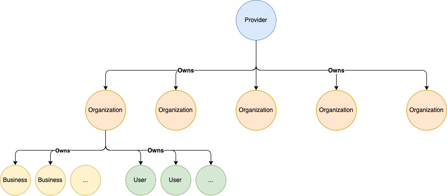
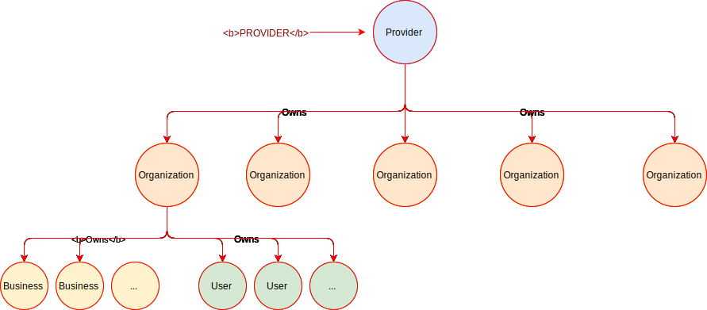
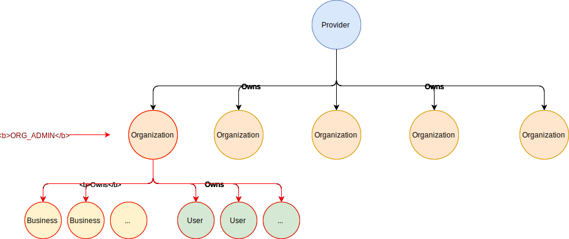
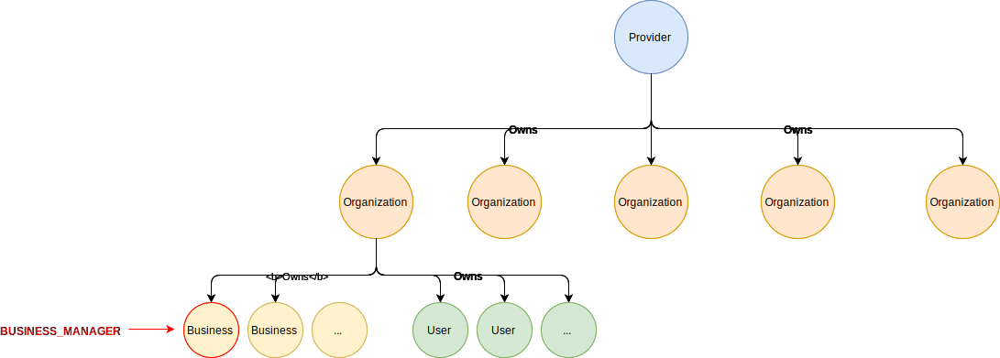

# Resources structure & access

In this chapter, you will learn how the Partoo resources are structured and what are the rules to access them.

## Resources structure

Partoo data is organised around **4 main resources**:

1. **Provider:** A provider represents the entity that signs the contract with the client using Partoo solution & products.
An obvious example of provider is Partoo itself but a provider can also be a reseller of Partoo solutions (for instance Editus).
A provider owns `organisations`, `businesses` and `users`. 
If you are a Partoo reseller there will be a provider resource representing you inside Partoo app.
2. **Organisation:** An organisation represents the legal entity, most likely a commercial company, that owns `businesses` (or listings).
If you are a Partoo client there are one or several organisations representing your companies.
An organisation belongs to a `provider`.
3. **User:** A user can be a Partoo app user or Partoo API user.
A user belongs to an `organisation` and has a `role` which gives him different levels of access on the different resources on Partoo (see section below).
4. **Business:** A business represents a listing. It belongs to an `organisation`

There are additional resources that are linked to these **4 main resources**.
For instance `reviews` and `analytics`(for Presence Management and Review Management) are linked to `businesses`. 

## Resources Access

When handling data through Partoo App or through Partoo REST API, you need to be authenticated as a user (thanks to your session cookie or your api key). 
Each user has role.

A `role` defines for each resource (for instance `user`) a`READ` and/or `WRITE` access with the scope on which this access can be used.

For instance a user with `BUSINESS_MANAGER` role has `WRITE` access on its own user and `READ` acces to all the users of its organisation.

For now there are 4 roles available:
- `PROVIDER` role is meant for reseller admin user. It can manage organisations, users and businesses of a provider
- `ORG_ADMIN` role is meant for client admin user. It can manage the user and businesses of its organisation
- `BUSINESS_MANAGER` role is meant for client business manager. It can manage several businesses
- `PUBLISHER` role is meant for publisher wanting to use Partoo as a data source. It can read Partoo businesses subscribed to presence management product

### PROVIDER
`PROVIDER` role is meant for reseller admin user. It can manage its provider organisations, users and businesses.

#### Read access
| Resource  |	Scope	   | Details                                           |
| --------- | -------- | ------------------------------------------------- |
| User	    | Provider | Can access the users that shares its provider     |
| Organisation | Provider | Can access the organisations that shares its provider      |
| Business	| Provider | Can access the businesses that share its provider |
| Category	| All	     | Can access all categories                         |

#### Write access
| Resource     |	Scope	   | Details                                           |
| ------------ | -------- | ------------------------------------------------- |
| User	       | Provider | - Can create user, it will share its provider   - Can update user that shares its provider   - Can give role `ORG_ADMIN` and `BUSINESS_MANAGER` to user|
| Organisation | Provider | - Can create organisation, it will share its provider   - Can update org that shares its provider      |
| Business	   | Provider | - Can create business, they will share its provider (and its org_id if no org_id given)   - Can update businesses that shares its provider |
| Category	   | not writable	    |                          |

### ORG_ADMIN
`ORG_ADMIN` role is meant for client admin user. It can manage its organisation users and businesses.

#### Read access
| Resource  |	Scope	   | Details                                           |
| --------- | -------- | ------------------------------------------------- |
| User	    | Organisation | Can access the users that shares its org_id     |
| Organisation | Organisation | Can access only its own org      |
| Business	| Organisation | Can access the businesses that shares its org_id |
| Category	| All	     | Can access all categories                         |

#### Write access
| Resource     |	Scope	   | Details                                           |
| ------------ | -------- | ------------------------------------------------- |
| User	       | Organisation | - Can create user, it will share its provider and its `org_id`.   - Can update user that shares its `org_id`   - Can only gives the role `BUSINESS_MANAGER` to its user|
| Organisation | Organisation | - Can update itself   - Cannot create new org. |
| Business	   | Organisation | - Can create business, it will share its provider and its `org_id`   - Can update businesses that shares its `org_id`|
| Category	   | not writable |                          |

### BUSINESS_MANAGER
`BUSINESS_MANAGER` role is meant for client business manager. It can manage several businesses.

#### Read access
| Resource  |	Scope	   | Details                                           |
| --------- | -------- | ------------------------------------------------- |
| User	    | Organisation | Can access the users that shares its org_id     |
| Organisation | Organisation | Can access only its own org      |
| Business	| Business | Can access the businesses that it has direct access to |
| Category	| All	     | Can access all categories                         |

#### Write access
| Resource     |	Scope	   | Details                                           |
| ------------ | -------- | ------------------------------------------------- |
| User	       | User | - Can update its user only|
| Organisation | No access |   |
| Business	   | Business | - Can update businesses that it has direct access to   - Cannot create business |
| Category	   | not writable |                          |

### PUBLISHER
`PUBLISHER` role is meant for publisher wanting to use Partoo as a data source. It can read Partoo businesses subscribed to presence management product.

#### Read access
| Resource  |	Scope	   | Details                                           |
| --------- | -------- | ------------------------------------------------- |
| User	    | No access |        |
| Organisation | All | Can access all Partoo organisations      |
| Business	| Subscribed to Presence Management | Can access the businesses subscribed to presence management product |
| Category	| All	     | Can access all categories                         |

#### Write access
**NO write access**
